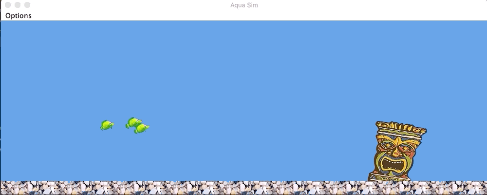

# Aqua Sim

Aqua Sim is a simple aquarium simulator that adopts the principles of Boids to simulate a flocking artificial life program. To add more fish into the aquarium simple click on where you would like the fish to spawn and it will do so.

## Building

Building Aqua Sim is very easy provided you have Gradle installed. To build and run straight away do the following:

```gradle runJar```

To just build run:

```gradle build```

And the executable will be built in build/libs.

## Example

